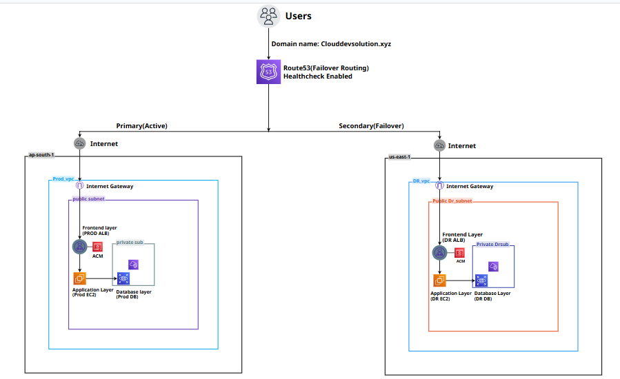

# Highly Available Multi-Region WordPress Infrastructure on AWS

## 📌 Overview
Designed and deployed a multi-region WordPress infrastructure on AWS with Production and Disaster Recovery (DR) environments to ensure high availability, fault tolerance, and automatic failover.

This architecture ensures that if the primary region fails, traffic is automatically redirected to the DR region using Route 53 health checks and failover routing.

---

## ☁️ AWS Services Used
- Amazon EC2
- Application Load Balancer (ALB)
- Amazon RDS
- Amazon Route 53
- AWS Certificate Manager (ACM)
- Amazon CloudWatch
- Amazon SNS
- IAM
- VPC

---

## 🏗️ Architecture Design
- **Production Region**
  - EC2 instances hosting WordPress
  - Application Load Balancer (ALB)
  - Primary RDS database

- **DR Region**
  - EC2 instances (standby WordPress setup)
  - Application Load Balancer (ALB)
  - DR RDS database (standby)

- **Global Setup**
  - Route 53 Failover Routing Policy
  - ACM for HTTPS/SSL encryption

---

## 🔁 Disaster Recovery Flow
1. User traffic is routed through Route 53 DNS
2. Requests are sent to the Production ALB
3. CloudWatch continuously monitors production health
4. If a failure is detected:
   - ALB/EC2 health check fails
   - Route 53 marks primary region as unhealthy
5. Traffic is automatically redirected to the DR region
6. DR environment takes over application delivery

---

## ⚙️ Automation Script

### WordPress Setup Script

A shell script is used to automate WordPress installation and configuration on EC2 instances in both Production and DR regions.

### 📁 Script Location:
[Wordpress-setup.sh](/Scripts/Wordpress-setup.sh)

### 🎯 Purpose:
- Automates WordPress deployment on EC2
- Ensures identical configuration across regions
- Reduces manual setup errors
- Speeds up infrastructure provisioning

### 🧾 Script Functions:
- Installs Apache web server
- Installs PHP dependencies
- Downloads and configures WordPress
- Sets correct file permissions
- Starts and enables required services

---

## 📊 CloudWatch Monitoring

CloudWatch is configured to monitor the health and performance of the Production environment.

### 📌 Monitored Metrics:
- EC2 CPU Utilization
- RDS CPU Utilization
- Application Load Balancer UnHealthyHostCount
  

### 🚨 Alerting:
- CloudWatch alarms monitor EC2 CPU Utilization, RDS CPU Utilization, and ALB UnHealthyHostCount.
- Amazon SNS sends real-time email notifications when alarms enter the ALARM state.
- Alerts help administrators quickly respond to production issues.
---

## 🔔 Notification System (SNS)

Amazon SNS is integrated with CloudWatch Alarms to provide real-time email notifications whenever a monitored metric exceeds its configured threshold.

### Features:
- Sends automated email alerts when CloudWatch alarms enter the ALARM state.
- Notifies administrators about high EC2 CPU utilization.
- Notifies administrators about high RDS CPU utilization.
- Alerts when unhealthy targets are detected behind the Application Load Balancer.
- Enables faster incident response and troubleshooting.

## 🌐 Route 53 Failover Configuration
- Primary record points to Production ALB
- Secondary record points to DR ALB
- Health checks continuously monitor Production endpoint
- Automatic DNS failover enables traffic switching

---

## 📸 Screenshots

[Prod-Ec2.png](/Screenshots/Prod-Ec2.png)

[DR-EC2.png](/Screenshots/DR-EC2.png)

[Prod-Alb.png](/Screenshots/Prod-Alb.png)

[DR-alb.png](/Screenshots/DR-Alb(3).png)

[PROD-DB.png](/Screenshots/PROD-DB.png)

[DR-DB.png](/Screenshots/DR-DB.png)

[Route53-Failover-Records.png](/Screenshots/Route53-Failover-Records.png)

[Route53-Healthcheck-Unhealthy.png](/Screenshots/Route53-Healthcheck-Unhealthy.png)

[CLOUDWATCH-MONITORING_DASHBOARD.png](/Screenshots/CLOUDWATCH-MONITORING_DASHBOARD.png)

[EC2-CPU-UTILIZATION-ALARM.png](/Screenshots/EC2-CPU-UTILIZATION-ALARM.png)

[RDS-CPU-UTILIZATION-ALARM.png](/Screenshots/RDS-CPU-UTILIZATION-ALARM.png)

[UNHEALTHY-HOSTCOUNT-ALARM.png](/Screenshots/UNHEALTHY-HOSTCOUNT-ALARM.png)

[SNS-EMAIL-ALERT.png](/Screenshots/SNS-EMAIL-ALERT.png)
  
---

## 🚀 Outcome
Successfully built a highly available and disaster recovery-enabled AWS architecture with:
- Automated failover mechanism
- Real-time monitoring and alerting
- Secure HTTPS-based deployment
- Scalable WordPress infrastructure
- Multi-region fault tolerance

---

## 👨‍💻 Key Learning
- AWS Multi-region architecture design
- Disaster Recovery (DR) strategy implementation
- Route 53 failover routing
- CloudWatch monitoring and SNS alerting
- EC2 automation using shell scripting
